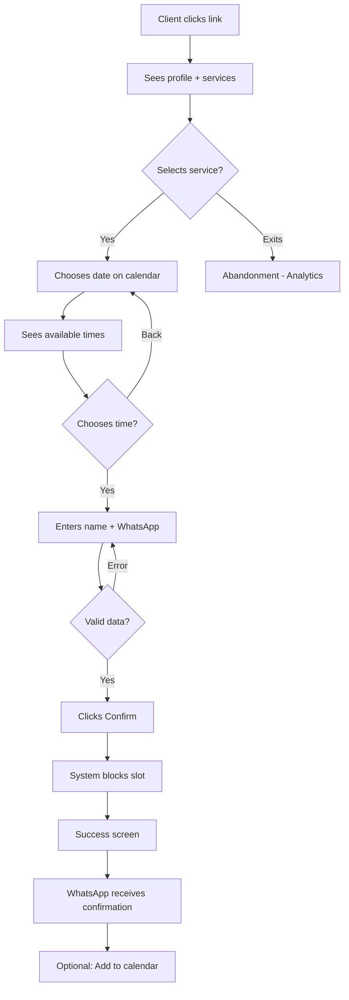
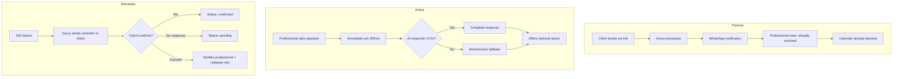
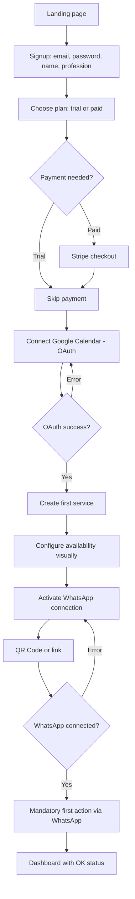
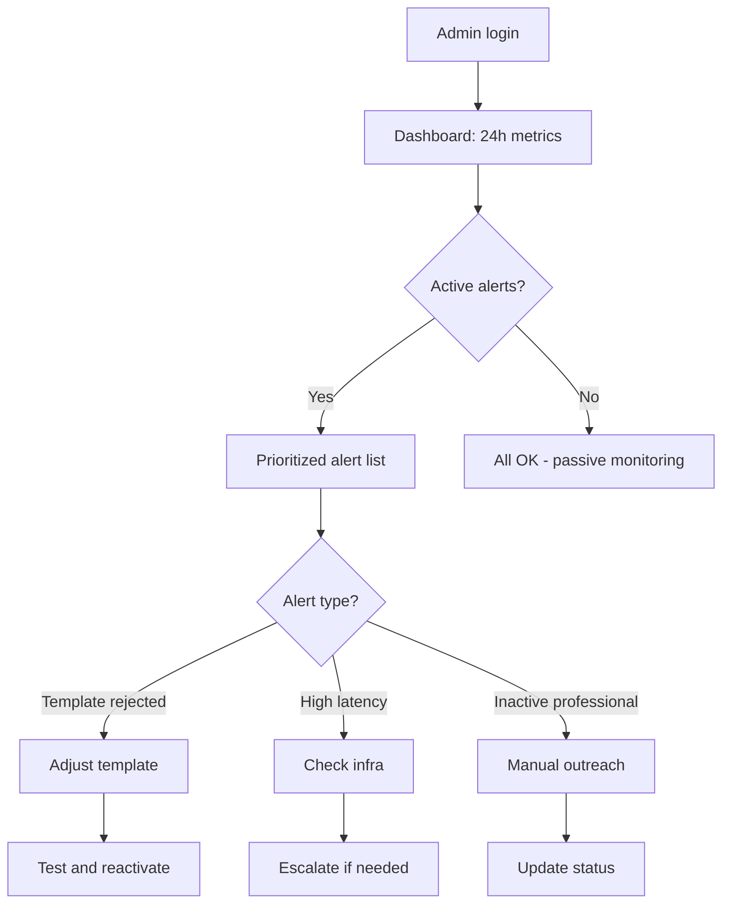

# UX Design Specification zavvy

**Author:** Piffer
**Date:** 2025-12-26

---

## Executive Summary

### Project Vision

Zavvy is a WhatsApp-first intelligent scheduling assistant for solo professionals in Brazil. Unlike traditional scheduling tools (Calendly, Google Calendar) that require behavior change, Zavvy integrates into the professional's existing workflow—where WhatsApp already is.

**Core positioning:** "Tools organize calendars. Zavvy takes care of yours."

**Model:** Professionals use Zavvy's centralized WABA infrastructure—zero WhatsApp Business setup required.

**Channel Architecture:**
| Channel | Purpose |
|---------|---------|
| **Web App** | Setup + Vision + Control |
| **WhatsApp** | Daily Operation (Assistant) |
| **Booking Link** | Client Self-Service |
| **Admin Panel** | Zavvy Operations (low UX priority) |

### Target Users

| User | Profile | Interface | Tech Level |
|------|---------|-----------|------------|
| **Professional** | Psychologists, lawyers, hairdressers, nutritionists (25-50 years). Sell time, live on WhatsApp, exhausted from logistics. | Web App + WhatsApp | Intermediate |
| **End Client** | Busy person who wants to book fast, no conversation, no login. | Booking Link | Any |
| **Zavvy Operator** | Internal team maintaining the platform (templates, monitoring). | Admin Panel | Technical |

**Device context:** Mobile-first (especially WhatsApp and booking). Web desktop for initial setup.

### Key Design Challenges

1. **Channel mental model separation**
   - Web = Setup/Vision, WhatsApp = Operation
   - User needs to understand where to do each thing without confusion

2. **Web-first onboarding but "Aha" on WhatsApp**
   - Setup is on web, but perceived value is on WhatsApp
   - Transition must be fluid and mandatory (first action via WhatsApp)

3. **Zero friction for end client**
   - 47 seconds from click to confirmed booking
   - Zero login, zero account, absolute mobile-first

4. **"Assistant, not tool" feeling**
   - Visual must convey lightness, not corporate software
   - Sensation of "someone caring", not "system to configure"

### Design Opportunities

1. **Booking Link as professional showcase**
   - Client's first impression of the professional
   - Opportunity to convey organization and professionalism

2. **Dashboard as "visual tranquility"**
   - Show that everything is under control
   - Less is more—no need for 50 metrics

3. **Onboarding as quick win**
   - If in 8 minutes the professional feels "this is already working", they stay

4. **Admin Panel: functional > pretty**
   - Focus on operational efficiency, not polish
   - Clear tables, quick actions, accessible logs

---

## Core User Experience

### Defining Experience

**The Emotional Loop (Most Important):**

```
Client books → Zavvy understands → Schedules → Confirms → Professional does nothing → Feels relief
```

If any part of this loop fails, the product doesn't "close" emotionally. This loop connects directly to NFRs (ack, latency, fallback), FRs (full automation), and the value proposition.

**Core User Action:**
- **Professional:** Receive notification of confirmed booking (passive—doing nothing is success)
- **End Client:** Select time slot and confirm in <60 seconds

**Core Success Metric:** % of bookings completed without professional intervention

### Platform Strategy

| Platform | Type | Context | Priority |
|----------|------|---------|----------|
| **Web App** | Responsive, desktop-first for setup | Mouse/keyboard, structured forms | High |
| **Booking Link** | Absolute mobile-first | Touch, speed is critical | High |
| **Admin Panel** | Desktop-only acceptable | Tables, operational efficiency | Low |
| **WhatsApp** | Conversational (no custom UI) | Natural text | N/A (no UI) |

**Offline:** Not required. Connection is a premise.

**Platform-specific capabilities:**
- OAuth for calendars (Google, Outlook)
- Deep link to WhatsApp
- Push notifications (mobile web)

### Effortless Interactions

| What | How It Should Feel |
|------|-------------------|
| **Booking (client)** | 3 clicks: service → time → confirm. 47 seconds max. |
| **View schedule (professional)** | "Zavvy, how's tomorrow?" → response in 2s |
| **Receive confirmation** | Clear push/notification, no need to open anything |
| **Reschedule** | Natural language: "need to change" → Zavvy resolves |

**What must be automatic:**
- Calendar blocking
- Confirmation sent to client
- Notification to professional
- Slot release on cancellation

**Anti-pattern:** Any notification that feels like "just another inbox" fails. Notifications must convey relief, not work.

### Critical Success Moments

| Moment | Description | If It Fails |
|--------|-------------|-------------|
| **Aha #1** | First automatic booking without seeing the conversation | Doesn't understand the value |
| **Web→WhatsApp Transition** | Setup complete + first action works | Abandons onboarding |
| **Client's 47 seconds** | Fast, frictionless booking link | Gives up, goes back to manual WhatsApp |
| **Graceful Fallback** | AI slow? Deterministic response, not silence | Loses trust |

**Golden Rule:** Client should never wait more than a few seconds for visual feedback, especially on booking link.

### Experience Principles

1. **"Doing nothing is success"**
   - The professional succeeds when they DON'T need to intervene
   - Fewer actions = more perceived value
   - Anti-pattern: anything requiring frequent action is suspect

2. **"Silence kills trust"**
   - Always respond, even if just "let me check"
   - Ack in 300ms, full response in 2.5s max
   - Client never waits without visual feedback

3. **"Web = setup, WhatsApp = life"**
   - Never force professional to open web for daily operation
   - Web is for configuring and panoramic view

4. **"Client doesn't negotiate, chooses"**
   - Booking link shows options, doesn't open conversation
   - Quick decision, instant confirmation

5. **"Functional > pretty (in admin)"**
   - Admin can be ugly, cannot be fragile
   - Operator needs efficiency, not design

---

## Desired Emotional Response

### Primary Emotional Goals

| User | Primary Emotion | Success Phrase |
|------|-----------------|----------------|
| **Professional** | **Relief** | "It was worth it because I stopped worrying about this" |
| **End Client** | **Confidence** | "This professional is organized" |
| **Zavvy Operator** | **Control** | "Everything is under control, I can act if needed" |

**Differentiating emotion:** Zavvy isn't efficiency (Calendly does that). It's **relief**—the feeling that someone is taking care of things.

**Ideal emotional state for professional:** "I trust, so I don't check."

**Key insight:** Client doesn't perceive Zavvy—perceives professionalism.

### Emotional Journey Mapping

| Stage | Professional | End Client |
|-------|--------------|------------|
| **Discovery** | Hope → "Will this solve it?" | N/A |
| **Onboarding** | Curiosity → Skepticism → "It worked!" | N/A |
| **First automation** | Surprise → "I didn't have to do anything" | Impressed → "That was fast" |
| **Daily use** | Peace → "I don't think about this anymore" | Satisfaction → "Easy to book" |
| **When something goes wrong** | Confidence → "Zavvy warned me" | Calm → "Got a quick response" |
| **Long term** | Positive dependency → "Can't live without it" | Perception → "Organized professional" |

### Micro-Emotions

| Emotion Pair | We Want | We Avoid | Impact |
|--------------|---------|----------|--------|
| **Confidence vs Skepticism** | Confidence from first ack | "Did it work?" | Retention |
| **Control vs Fear** | Control without micromanagement | "Lost control to the robot" | Adoption |
| **Relief vs Anxiety** | Relief when seeing notification | "Another thing to check" | Perceived value |
| **Lightness vs Weight** | "Light assistant" | "Corporate software" | Positioning |

### Design Implications

| Desired Emotion | UX Decision |
|-----------------|-------------|
| **Relief** | Notifications that convey "resolved", not "pending" |
| **Confidence** | Immediate ack (300ms), never silence |
| **Control** | Professional defines rules, Zavvy executes |
| **Lightness** | Clean visual, few elements, soft colors |
| **Impression (client)** | Polished booking link, confirms via WhatsApp (familiar channel) |

**Acceptable emotional error:** Making a mistake with communication is better than being right in silence.

**Emotional anti-patterns:**
- Notification that looks like "more work"
- Interface that looks like corporate ERP
- Silence after action (kills trust)
- Too many options/configurations (paralysis)

### Emotional Design Principles

1. **"Relief > Efficiency"**
   - We don't sell productivity, we sell peace of mind
   - Every interaction must reduce mental load, not add to it

2. **"Trust is built in milliseconds"**
   - Immediate ack, constant visual feedback
   - Error? Warn quickly, don't hide

3. **"Perceived control without micromanagement"**
   - Professional knows they can change rules
   - But doesn't need to keep checking

4. **"Visual lightness = emotional lightness"**
   - Less is more
   - Soft colors, white space, clear typography

5. **"Client sees professionalism"**
   - Booking link is a showcase
   - WhatsApp confirmation = familiar + organized

---

## UX Pattern Analysis & Inspiration

### Design Philosophy Statement

> **Zavvy combines the emotional trust of Nubank, the operational invisibility of Apple, and the decisional speed of Uber—all within the natural context of WhatsApp.**

This becomes a decision guide when someone asks: "Why not add this extra option?"

### Inspiring Products Analysis

#### Tier 1: Core Inspiration

| Product | What to Learn | Application to Zavvy |
|---------|---------------|---------------------|
| **Nubank** | Human language, no jargon. Constant feedback ("done", "resolved"). Feeling of someone caring. UX that reduces anxiety. | Primary reference for tone, trust, emotion, error communication, long-term relationship. "Nubank of scheduling." |
| **WhatsApp** | Native patterns, short clear messages, familiar environment. | Zavvy lives IN WhatsApp, doesn't compete with it. Don't "invent UX" inside the chat. |

#### Tier 2: Flow & Speed Inspiration

| Product | What to Learn | Application to Zavvy |
|---------|---------------|---------------------|
| **Uber** (passenger side) | Few decisions, clear confirmation, explicit status, user doesn't need to understand the system. | Booking link should feel more Uber than Calendly. |
| **iFood/Rappi** | Fast Brazilian onboarding, checkout in few clicks, mobile-first. | Speed patterns for booking flow. |
| **Apple (iOS/iCloud)** | Clear states (ok/error/syncing), silent automation, minimal visible configuration. "Works or warns you." | Calendar sync should be invisible. Zero "settings out of curiosity." |

#### Tier 3: Visual Reference (With Caution)

| Product | What to Learn | Caution |
|---------|---------------|---------|
| **Notion** | Visual lightness, white space. | Can become "tool for power users." Too much freedom ≠ relief. Use visual only, not mental model. |
| **Calendly** | Fast booking flow, technical benchmark. | It's a tool, not an assistant. Doesn't generate emotional relief. Know where NOT to look like Calendly. |

### Anti-Patterns to Avoid

#### ❌ Traditional CRMs (Salesforce, RD, HubSpot)
- Interface that screams "work"
- Too many options → anxiety
- User feels like they became a system operator
- **Risk:** If Zavvy looks like a CRM, breaks "doing nothing is success" principle

#### ❌ Old Medical Scheduling Systems
- Dates, tables, codes
- Cold language
- Long flows
- **Risk:** Exactly what the professional wants to escape from

#### ❌ "Intelligent" Bots That Ask Too Much
- Classic pattern: "Hello! To proceed, select an option: 1, 2, 3..."
- Breaks naturalness
- Feels like IVR
- Removes relief
- **Risk:** Zavvy is NOT a menu, it's an assistant

### Transferable UX Patterns

#### Navigation Patterns
| Pattern | Source | Zavvy Application |
|---------|--------|-------------------|
| Bottom navigation (mobile) | iOS/Nubank | Web app mobile view |
| Progressive disclosure | Apple | Settings complexity hidden by default |
| Status-first dashboard | Uber | Calendar view shows "all good" or "attention needed" |

#### Interaction Patterns
| Pattern | Source | Zavvy Application |
|---------|--------|-------------------|
| One-tap confirmation | Uber/iFood | Booking link final step |
| Optimistic UI | Nubank | Show success before server confirms |
| Pull to refresh | iOS | Calendar sync trigger |
| Swipe actions | iOS Mail | Quick reschedule/cancel in appointment list |

#### Feedback Patterns
| Pattern | Source | Zavvy Application |
|---------|--------|-------------------|
| Immediate ack | WhatsApp (blue ticks) | "Entendi, já vejo..." within 300ms |
| Success celebration (subtle) | Nubank | Booking confirmed animation |
| Error with next step | Apple | "Couldn't sync. Try again?" not just "Error." |

### Design Inspiration Strategy

**Adopt Directly:**
- Nubank tone of voice and trust-building patterns
- WhatsApp message brevity and clarity standards
- Uber's few-decisions booking flow
- Apple's silent sync and clear state indicators

**Adapt for Context:**
- Notion's visual lightness (without the power-user flexibility)
- Calendly's booking efficiency (without the corporate coldness)
- iFood's mobile speed (adapted for scheduling context)

**Actively Avoid:**
- CRM-style dashboards with too many metrics
- Menu-based bot interactions ("press 1 for...")
- Table-heavy interfaces
- Configuration overload
- Cold, system-like language

---

## Design System Foundation

### Design System Choice

**Selected:** Tailwind CSS + shadcn/ui

This combination provides the best balance for Zavvy's needs: visual lightness, development speed, mobile-first capability, and sufficient customization without the "template look."

### Rationale for Selection

| Requirement | How Tailwind + shadcn/ui Delivers |
|-------------|----------------------------------|
| **Visual lightness** | No default visual weight—you build the aesthetic from scratch |
| **Nubank-like feel** | Similar approach to what modern Brazilian fintechs use |
| **Mobile-first** | Tailwind is built for responsive design |
| **Development speed** | shadcn/ui provides copy-paste components, not heavy dependencies |
| **Avoids template look** | Unlike MUI/Ant Design, doesn't have recognizable "flavor" |
| **Performance** | Minimal CSS output, natural tree-shaking |
| **Admin Panel simplicity** | Same system, just less polish applied |

### Implementation Stack

| Layer | Tool | Purpose |
|-------|------|---------|
| **Utility CSS** | Tailwind CSS | Base styling, responsive utilities |
| **Component Library** | shadcn/ui | Buttons, inputs, modals, dialogs, etc. |
| **Icons** | Lucide React | Clean, consistent iconography (ships with shadcn) |
| **Design Tokens** | CSS Custom Properties | Colors, typography, spacing (Tailwind config) |
| **Dark Mode** | Tailwind `dark:` | Structure ready, not MVP priority |

### Customization Strategy

**Design Tokens to Define:**
```
Colors:
- Primary: Zavvy brand (TBD in visual design phase)
- Semantic: Success, Warning, Error, Info
- Neutral: Gray scale for text, borders, backgrounds

Typography:
- Font family: Clean sans-serif (Inter, Geist, or similar)
- Scale: Limited set (sm, base, lg, xl, 2xl)
- Weight: Regular, Medium, Semibold only

Spacing:
- 4px base unit (Tailwind default)
- Consistent padding/margin scale

Border Radius:
- Slightly rounded (8px-12px) for friendly feel
- Not fully rounded (avoids "toy" look)
```

### Per-Interface Strategy

| Interface | Design Effort | Customization Level |
|-----------|---------------|---------------------|
| **Web App (Professional)** | High | Full brand application, polished components |
| **Booking Link (Client)** | High | Maximum polish, mobile-optimized, fast loading |
| **Admin Panel (Zavvy)** | Low | shadcn/ui defaults, minimal customization, functional focus |

### Component Priority

**MVP Must-Have Components:**
- Button (primary, secondary, ghost)
- Input + Form validation
- Select / Dropdown
- Modal / Dialog
- Card
- Calendar / Date picker
- Time slot selector
- Toast / Notification
- Loading states
- Empty states

**Can Use Defaults (Admin):**
- Data tables
- Tabs
- Accordion
- Badge / Tag

---

## Defining Core Experience

### Experience Summary by Interface

| Interface | Defining Experience | User Phrase |
|-----------|---------------------|-------------|
| **Booking Link** | "I chose a time and it was already confirmed" | "3 clicks, 47 seconds" |
| **WhatsApp** | "I asked and Zavvy answered immediately" | "Didn't need to open anything" |
| **Web App** | "I opened it and everything was fine" | "Just checked, didn't need to do anything" |
| **Admin** | "I saw the alert and resolved it quickly" | "Works, doesn't get in my way" |

### Booking Link Flow (Client)

```
[1] CLIENT ARRIVES
    └── Clicks link (story, bio, message)

[2] SERVICE SELECTION
    └── Sees professional name/photo
    └── Service list with duration + price
    └── Selects 1 or more services
    └── Duration auto-calculated

[3] TIME SELECTION
    └── Visual calendar with available slots
    └── Unavailable slots DON'T APPEAR (prevents frustration)
    └── Clear slot selection

[4] CONFIRMATION
    └── Name + WhatsApp only (minimum data)
    └── Single "Confirm" button
    └── Zero login, zero account

[5] SUCCESS
    └── Instant success screen with summary
    └── WhatsApp confirmation in <5s
    └── Optional "Add to calendar"
```

**Total time:** ≤47 seconds
**Clicks:** 3-4 (service → time → data → confirm)
**Pattern:** Uber/iFood checkout

### WhatsApp Flow (Professional)

#### Scenario 1: Active Query
```
PROFESSIONAL: "Zavvy, how's my schedule tomorrow?"

ACK (0-300ms): "👌 Let me check..."

RESPONSE (300ms-2.5s):
"Tomorrow you have 4 appointments:
 8h Maria - Individual Session
 9h João - First Consultation
 14h Carla - Individual Session
 15:30 Pedro - Individual Session
 Want me to make any changes?"
```

#### Scenario 2: Passive Notification
```
CLIENT → Booking Link → Confirms

NOTIFICATION TO PROFESSIONAL:
"✅ New appointment confirmed:
 Maria Silva - Individual Session
 Tomorrow, 4pm
 Already blocked on your calendar."
```

**Key patterns:**
- Never show numeric menu as default (only extreme fallback)
- Notification is conclusive—doesn't request action
- Delivers relief, not obligation

**Fallback:** If AI >1.5s → deterministic response, never silence

### Web App Flow (Professional)

```
┌─────────────────────────────────────────────────────┐
│ DASHBOARD: Status at a glance                        │
│                                                      │
│  ┌────────────────────────────────────────────────┐ │
│  │ Today: 5 appointments | Tomorrow: 4            │ │
│  │ ✅ All confirmed                               │ │
│  └────────────────────────────────────────────────┘ │
│                                                      │
│  [Weekly calendar view]                              │
│                                                      │
└─────────────────────────────────────────────────────┘
```

**Principle:** Status-first. If everything is OK, show "all OK."
**Actions:** Only appear when there's something to resolve (not menu by habit)

### Admin Panel Flow (Zavvy Operator)

**Principle:** Reactive, alert-oriented, not protagonist.
- See alert → Resolve quickly
- No unnecessary dashboards
- "Works, doesn't get in my way"

### Novel vs Established Patterns

| Aspect | Type | Approach |
|--------|------|----------|
| **Booking flow** | Established | Uber/Calendly pattern |
| **WhatsApp conversational** | Novel | NLU + graceful fallback |
| **"All OK" dashboard** | Semi-novel | Less common in SaaS, but intuitive |
| **Notification as product** | Novel | Not an alert—it's value delivery |

**Where to innovate:** Natural conversation + notification as relief
**Where to follow pattern:** Booking link, forms, navigation

### Success Criteria

| Experience | Success Criterion | Test |
|------------|-------------------|------|
| **Booking Link** | Client confirms without help, <60s | Time to complete, drop-off rate |
| **WhatsApp** | Professional feels "someone answered" | Qualitative feedback |
| **Web App** | Professional opens, sees "OK", closes | Session duration <30s when no issues |
| **Notification** | Professional feels relief, not obligation | "Inbox zero" feeling |

### Core Insight

> **The notification doesn't point to the product. It IS the product in that moment.**

This connects directly to:
- Relief emotion
- Retention
- Daily perceived value

---

## Visual Design Foundation

### Visual Direction

**Vibe:** Light, trustworthy, human. Nubank meets WhatsApp.

| Aspect | Direction | Anti-pattern |
|--------|-----------|--------------|
| **Tone** | Friendly, professional without being corporate | Cold, institutional |
| **Density** | Airy, generous white space | Dense, crowded |
| **Colors** | Soft, welcoming, clear contrast | Too vibrant, high saturation |
| **Shape** | Slightly rounded edges (8-12px) | Hard squares or exaggerated pills |

### Color System

**Theme:** Verde Confiança (Trust Green)

```css
/* Primary */
--color-primary: #10B981;        /* Emerald green - trust, health */
--color-primary-dark: #059669;   /* Hover/active states */
--color-primary-light: #D1FAE5;  /* Backgrounds, highlights */

/* Backgrounds */
--color-background: #FAFAFA;     /* Off-white, soft */
--color-surface: #FFFFFF;        /* Cards, modals */

/* Text */
--color-text: #1F2937;           /* Dark gray, not pure black */
--color-text-muted: #6B7280;     /* Secondary text */
--color-text-light: #9CA3AF;     /* Placeholders, hints */

/* Borders */
--color-border: #E5E7EB;         /* Default borders */
--color-border-light: #F3F4F6;   /* Subtle dividers */

/* Semantic */
--color-success: #10B981;        /* Same as primary */
--color-warning: #F59E0B;        /* Amber */
--color-error: #EF4444;          /* Red */
--color-info: #3B82F6;           /* Blue */
```

**Rationale:**
- Green aligns with health/wellness (many target professionals)
- Transmits trust and calm
- Differentiates from Calendly (blue) without being too bold
- Works well with Nubank-inspired design language

### Typography System

**Font Family:** Inter (or Geist as alternative)

| Use | Weight | Size | Line Height |
|-----|--------|------|-------------|
| **Display** | Semibold (600) | 24-32px | 1.2 |
| **Heading H1** | Semibold (600) | 24px | 1.3 |
| **Heading H2** | Medium (500) | 20px | 1.3 |
| **Heading H3** | Medium (500) | 18px | 1.4 |
| **Body** | Regular (400) | 16px | 1.5 |
| **Body Small** | Regular (400) | 14px | 1.5 |
| **Caption** | Regular (400) | 12px | 1.4 |
| **WhatsApp** | System default | Native | Native |

**Font choice rationale:**
- Clean, modern, highly legible
- Excellent Portuguese support (accents)
- Free, well-supported across platforms
- Similar to what Nubank uses

### Spacing System

**Base unit:** 4px

```css
/* Spacing scale */
--space-xs: 4px;    /* Inline elements, tight spacing */
--space-sm: 8px;    /* Between labels and inputs */
--space-md: 16px;   /* Between cards, form groups */
--space-lg: 24px;   /* Between sections */
--space-xl: 32px;   /* Main margins */
--space-2xl: 48px;  /* Section separation */
--space-3xl: 64px;  /* Page-level separation */

/* Border radius */
--radius-sm: 6px;   /* Buttons, inputs, badges */
--radius-md: 8px;   /* Cards, dropdowns */
--radius-lg: 12px;  /* Modals, larger containers */
--radius-full: 9999px; /* Pills, avatars */
```

**Layout principle:** Airy > Dense. When in doubt, add more space.

### Accessibility Requirements

| Requirement | Target | Standard |
|-------------|--------|----------|
| **Text contrast** | ≥4.5:1 | WCAG AA |
| **Button contrast** | ≥3:1 | WCAG AA |
| **Minimum touch target** | 44×44px | iOS/Android guidelines |
| **Minimum body font** | 16px | Mobile readability |
| **Minimum secondary font** | 14px | Legibility |
| **Focus indicators** | Visible | Keyboard navigation |

### Per-Interface Visual Strategy

| Interface | Visual Treatment |
|-----------|------------------|
| **Web App** | Full brand application, polished, airy |
| **Booking Link** | Maximum polish, fast-loading, mobile-optimized, trust-building |
| **Admin Panel** | Functional, clean but minimal polish, data-focused |
| **WhatsApp** | Respect native styling, no custom UI |

---

## Design Direction Decision

### Chosen Direction

**"Verde Confiança + Nubank Lightness"**

A single, cohesive direction combining:
- Trust Green (#10B981) as primary brand color
- Airy, generous white space
- Status-first information hierarchy
- Friendly but professional tone
- Mobile-first responsive approach

### Key Screen Visual Descriptions

#### 1. Professional Dashboard (Web App)

```
┌────────────────────────────────────────────────────────────┐
│  [Zavvy Logo]                    [Profile] [Settings]      │
├────────────────────────────────────────────────────────────┤
│                                                            │
│  ┌──────────────────────────────────────────────────────┐ │
│  │  ✅ Tudo confirmado                                   │ │
│  │  Hoje: 5 consultas  |  Amanhã: 4 consultas           │ │
│  │  [Ver detalhes →]                                     │ │
│  └──────────────────────────────────────────────────────┘ │
│                                                            │
│  ┌─────────────────────────────────────────────────────┐  │
│  │  CALENDÁRIO SEMANAL                                  │  │
│  │  ┌─────┬─────┬─────┬─────┬─────┬─────┬─────┐        │  │
│  │  │ Seg │ Ter │ Qua │ Qui │ Sex │ Sáb │ Dom │        │  │
│  │  ├─────┼─────┼─────┼─────┼─────┼─────┼─────┤        │  │
│  │  │ ███ │ ██  │ ███ │ ██  │ ███ │ █   │     │        │  │
│  │  │ ███ │ ██  │ ███ │ ███ │ ██  │     │     │        │  │
│  │  └─────┴─────┴─────┴─────┴─────┴─────┴─────┘        │  │
│  └─────────────────────────────────────────────────────┘  │
│                                                            │
│  [+ Novo agendamento]  [📋 Clientes]  [⚙️ Serviços]       │
│                                                            │
└────────────────────────────────────────────────────────────┘
```

**Visual characteristics:**
- Status card prominent at top (green background when OK)
- Calendar takes majority of screen real estate
- Actions as secondary, not primary focus
- Generous padding (24-32px margins)
- Cards with subtle shadow, 8px radius

#### 2. Booking Link (Mobile - Client View)

```
┌─────────────────────────────┐
│                             │
│    [Professional Photo]     │
│    Dra. Carolina Mendes     │
│    Psicóloga Clínica        │
│                             │
├─────────────────────────────┤
│                             │
│  Escolha um serviço:        │
│                             │
│  ┌─────────────────────────┐│
│  │ Sessão Individual       ││
│  │ 50 min • R$ 200         ││
│  └─────────────────────────┘│
│                             │
│  ┌─────────────────────────┐│
│  │ Primeira Consulta       ││
│  │ 1h20 • R$ 300           ││
│  └─────────────────────────┘│
│                             │
│  ┌─────────────────────────┐│
│  │ ☐ Sessão + Avaliação    ││
│  │ 2h • R$ 400             ││
│  └─────────────────────────┘│
│                             │
│  ┌─────────────────────────┐│
│  │      [Continuar]        ││
│  │    (Verde primário)     ││
│  └─────────────────────────┘│
│                             │
└─────────────────────────────┘
```

**Visual characteristics:**
- Professional's identity prominent (trust signal)
- Service cards with clear price/duration
- Single CTA button (green, full width)
- Maximum white space
- No navigation clutter
- Progress indicator subtle (dots or line)

#### 3. Booking - Time Selection

```
┌─────────────────────────────┐
│  ← Sessão Individual        │
│     50 min • R$ 200         │
├─────────────────────────────┤
│                             │
│  Dezembro 2025              │
│  ┌───┬───┬───┬───┬───┬───┐ │
│  │ S │ T │ Q │ Q │ S │ S │ │
│  ├───┼───┼───┼───┼───┼───┤ │
│  │   │   │   │26 │27 │28 │ │
│  │   │   │   │ ● │ ● │ ● │ │
│  │29 │30 │31 │ 1 │ 2 │ 3 │ │
│  │ ● │ ● │   │ ● │ ● │   │ │
│  └───┴───┴───┴───┴───┴───┘ │
│                             │
│  Sexta, 27 de dezembro      │
│                             │
│  ┌─────────┐ ┌─────────┐   │
│  │  09:00  │ │  10:00  │   │
│  └─────────┘ └─────────┘   │
│  ┌─────────┐ ┌─────────┐   │
│  │  14:00  │ │  15:00  │   │
│  └─────────┘ └─────────┘   │
│  ┌─────────┐                │
│  │  16:00  │                │
│  └─────────┘                │
│                             │
└─────────────────────────────┘
```

**Visual characteristics:**
- Only available days show indicator (●)
- Unavailable slots DON'T appear
- Time slots as tappable chips
- Selected state: green background
- Clear date context at top

#### 4. Booking - Confirmation

```
┌─────────────────────────────┐
│                             │
│  Quase lá!                  │
│                             │
│  ┌─────────────────────────┐│
│  │ Sessão Individual       ││
│  │ Sex, 27 dez • 14:00     ││
│  │ Dra. Carolina Mendes    ││
│  │ 50 min • R$ 200         ││
│  └─────────────────────────┘│
│                             │
│  Seus dados:                │
│                             │
│  Nome                       │
│  ┌─────────────────────────┐│
│  │ Maria Silva             ││
│  └─────────────────────────┘│
│                             │
│  WhatsApp                   │
│  ┌─────────────────────────┐│
│  │ (11) 99999-9999         ││
│  └─────────────────────────┘│
│                             │
│  ┌─────────────────────────┐│
│  │   ✓ Confirmar           ││
│  │     agendamento         ││
│  └─────────────────────────┘│
│                             │
└─────────────────────────────┘
```

**Visual characteristics:**
- Summary card with all details
- Minimal form (2 fields only)
- Large, confident CTA button
- No distractions

#### 5. Booking - Success

```
┌─────────────────────────────┐
│                             │
│         ✓                   │
│    (Large green check)      │
│                             │
│    Agendamento              │
│    confirmado!              │
│                             │
│  ┌─────────────────────────┐│
│  │ Sessão Individual       ││
│  │ Sex, 27 dez • 14:00     ││
│  │ Dra. Carolina Mendes    ││
│  │                         ││
│  │ Rua das Flores, 123     ││
│  │ Sala 45 - São Paulo     ││
│  └─────────────────────────┘│
│                             │
│  Você receberá uma          │
│  confirmação no WhatsApp.   │
│                             │
│  ┌─────────────────────────┐│
│  │  📅 Adicionar ao        ││
│  │     calendário          ││
│  └─────────────────────────┘│
│                             │
└─────────────────────────────┘
```

**Visual characteristics:**
- Celebration moment (but subtle)
- All info visible without scrolling
- "Add to calendar" as secondary action
- WhatsApp confirmation mentioned

#### 6. WhatsApp Message Formats

**New appointment notification:**
```
✅ Nova consulta confirmada:

Maria Silva
Sessão Individual
Sex, 27 dez às 14h

Já bloqueei no seu calendário.
```

**Schedule query response:**
```
Amanhã você tem 4 consultas:

8h - Maria (Sessão Individual)
9h - João (Primeira Consulta)
14h - Carla (Sessão Individual)
15h30 - Pedro (Sessão Individual)

Quer que eu faça alguma alteração?
```

**Acknowledgment (immediate):**
```
👌 Já vejo isso pra você...
```

**Message characteristics:**
- Short, scannable
- Emoji used sparingly (1-2 per message)
- Action items at the end
- No walls of text
- Brazilian Portuguese, informal but professional

#### 7. Admin Panel (Low Priority Visual)

```
┌────────────────────────────────────────────────────────────┐
│  Zavvy Admin    [Dashboard] [Clientes] [Templates] [Logs] │
├────────────────────────────────────────────────────────────┤
│                                                            │
│  📊 Visão Geral (últimas 24h)                             │
│  ┌────────────┬────────────┬────────────┬────────────┐    │
│  │ Profission.│ Mensagens  │ Entrega    │ Latência   │    │
│  │ Ativos     │ Enviadas   │            │ p95        │    │
│  │ 847        │ 12.340     │ 98.7%      │ 1.8s       │    │
│  └────────────┴────────────┴────────────┴────────────┘    │
│                                                            │
│  ⚠️ Alertas (3)                                           │
│  ┌──────────────────────────────────────────────────────┐ │
│  │ Template "lembrete_24h" - rejeição > 1%              │ │
│  │ Profissional ID 4521 - 0 agendamentos (7 dias)       │ │
│  │ Latência subiu para 2.8s (p95)                       │ │
│  └──────────────────────────────────────────────────────┘ │
│                                                            │
└────────────────────────────────────────────────────────────┘
```

**Visual characteristics:**
- Dense but organized
- Data tables acceptable here
- Alerts prominent
- Functional over beautiful
- Same color tokens, less polish

### Design Rationale

| Decision | Rationale |
|----------|-----------|
| **Single direction** | Strong alignment throughout workflow; no need for variations |
| **Status-first dashboard** | Supports "doing nothing is success" principle |
| **Minimal booking flow** | 47-second target requires zero friction |
| **Sparse WhatsApp messages** | Respect native context, don't compete |
| **Admin as utility** | "Can be ugly, cannot be fragile" |

### Implementation Notes

- Use shadcn/ui components as base
- Customize with Zavvy color tokens
- Mobile-first CSS (booking link especially)
- Test contrast ratios before shipping
- WhatsApp messages: plain text only, no rich formatting

---

## User Journey Flows

### Journey 1: Client Booking (Juliana)



**Total time:** ≤47 seconds
**Abandonment points:** B, D, E
**Error recovery:** Inline validation, automatic retry

### Journey 2: Professional Daily Operation (Carolina)



**Principle:** Professional is notified, not requested.

### Journey 3: Professional Onboarding (Ana)



**Target time:** ≤8 minutes
**Mandatory gates:** Calendar, WhatsApp, first action
**Aha moment:** Step N - first interaction works

### Journey 4: Edge Cases (Ricardo)

```mermaid
flowchart TD
    subgraph Reschedule
        A1[Client requests change] --> A2{Via WhatsApp or link?}
        A2 -->|WhatsApp| A3[Zavvy understands intent]
        A2 -->|Link| A4[Reschedule button in email]
        A3 --> A5[Offers new times]
        A4 --> A5
        A5 --> A6[Client chooses]
        A6 --> A7[Confirms new time]
        A7 --> A8[Notifies professional]
        A8 --> A9[Updates calendar automatically]
    end

    subgraph Cancellation
        B1[Client cancels] --> B2[Releases slot immediately]
        B2 --> B3[Notifies professional]
        B3 --> B4[Slot available for next booking]
    end

    subgraph Conflict
        C1[External calendar creates event] --> C2[Sync detects conflict]
        C2 --> C3[Google Calendar = source of truth]
        C3 --> C4[Blocks slot in Zavvy]
        C4 --> C5{Had appointment?}
        C5 -->|Yes| C6[Notifies professional: conflict]
        C5 -->|No| C7[Silent]
    end

    subgraph Fallback
        D1[AI doesn't understand] --> D2[Response: didn't understand, but...]
        D2 --> D3[Offers booking link or direct contact]
        D3 --> D4[Professional resolves manually]
    end
```



**Principle:** Error with communication > silence.

### Journey 5: Admin Operations (Lucas)



**Principle:** Reactive, not proactive. Alert-driven.

### Journey Patterns

| Pattern | Description | Usage |
|---------|-------------|-------|
| **Immediate ack** | Response in 300ms, even if incomplete | WhatsApp, booking |
| **Graceful fallback** | Always offer alternative when AI fails | All intents |
| **Conclusive notification** | Don't request action, deliver result | Professional notifications |
| **Progressive disclosure** | Show only what's needed at each step | Onboarding, booking |
| **Inline error** | Validate without blocking flow | Forms |

### Flow Optimization Principles

1. **Fewer steps = more conversion** - Each extra step loses users
2. **Constant feedback** - Never leave user without knowing what's happening
3. **Error ≠ block** - Always offer recovery path
4. **Optional action > mandatory action** - Professional can ignore if all OK
5. **Absolute mobile-first** - Booking link optimized for touch

---

## Component Strategy

### Design System Components (shadcn/ui)

| Component | Status | Zavvy Usage |
|-----------|--------|-------------|
| Button | ✅ Ready | CTAs, actions |
| Input | ✅ Ready | Forms |
| Select | ✅ Ready | Dropdowns |
| Dialog/Modal | ✅ Ready | Confirmations |
| Card | ✅ Ready | Containers |
| Toast | ✅ Ready | Notifications |
| Calendar | ✅ Ready | Date picker base |
| Form | ✅ Ready | Validation |
| Tabs | ✅ Ready | Navigation |
| Badge | ✅ Ready | Status tags |
| Avatar | ✅ Ready | Professional photo |
| Skeleton | ✅ Ready | Loading states |

### Custom Components

#### TimeSlotPicker

**Purpose:** Select available time slot quickly and visually
**Usage:** Booking Link (Step 2)

```
┌─────────────────────────────────┐
│  Friday, December 27            │  ← Selected date
├─────────────────────────────────┤
│ [09:00] [10:00] [11:00]        │  ← Slots as chips
│ [14:00] [15:00] [16:00]        │
└─────────────────────────────────┘
```

**States:**
- default: Gray border, white background
- hover: Light green border
- selected: Green background, white text
- disabled: Don't render (unavailable slots disappear)

**Behavior:**
- Tap = select (not toggle)
- Only 1 selection at a time
- Horizontal scroll if many slots

#### ServiceCard

**Purpose:** Show service with essential info and allow selection
**Usage:** Booking Link (Step 1)

```
┌─────────────────────────────────┐
│ [○] Individual Session         │  ← Checkbox + name
│     50 min • R$ 200            │  ← Duration + price
└─────────────────────────────────┘
```

**States:**
- default: Gray border
- hover: Light green border
- selected: Green border, checkbox checked

**Variants:**
- single: Radio button (1 service)
- multi: Checkbox (multiple services)

#### StatusBanner

**Purpose:** Show overall schedule status at a glance
**Usage:** Dashboard (top)

```
┌─────────────────────────────────┐
│ ✅ All confirmed                │
│ Today: 5 | Tomorrow: 4         │
│ [View details →]               │
└─────────────────────────────────┘
```

**States:**
- ok: Light green background, check icon
- attention: Light yellow background, warning icon
- problem: Light red background, alert icon

**Variants:**
- expanded: Shows list of pending items
- collapsed: Summary only

#### AppointmentCard

**Purpose:** Show individual appointment compactly
**Usage:** Dashboard, lists, calendar

```
┌─────────────────────────────────┐
│ 14:00  Maria Silva             │  ← Time + name
│        Individual Session      │  ← Service
│        ✅ Confirmed            │  ← Status
└─────────────────────────────────┘
```

**States:**
- confirmed: Green badge
- pending: Yellow badge
- cancelled: Red badge, strikethrough text

**Actions:**
- Click: Expand details
- Swipe (mobile): Reschedule/Cancel

#### WeekCalendarView

**Purpose:** Weekly schedule view with occupied slots
**Usage:** Main dashboard

```
┌─────┬─────┬─────┬─────┬─────┬─────┬─────┐
│ Mon │ Tue │ Wed │ Thu │ Fri │ Sat │ Sun │
├─────┼─────┼─────┼─────┼─────┼─────┼─────┤
│ 8h  │     │ 8h  │     │ 9h  │     │     │
│ 9h  │ 10h │ 9h  │ 14h │ 10h │     │     │
│ 14h │ 11h │     │ 15h │ 14h │     │     │
└─────┴─────┴─────┴─────┴─────┴─────┴─────┘
```

**Behavior:**
- Each block = mini appointment card
- Click = expand details
- Horizontal swipe = navigate weeks
- Today highlighted

#### AvailabilityEditor

**Purpose:** Configure working hours visually
**Usage:** Onboarding, Settings

```
┌─────────────────────────────────────────┐
│ Monday                    [Active ✓]    │
│ ┌─────────────────────────────────────┐ │
│ │ 08:00 ──────────────────── 12:00   │ │
│ │ 14:00 ──────────────────── 18:00   │ │
│ └─────────────────────────────────────┘ │
│ [+ Add interval]                        │
└─────────────────────────────────────────┘
```

**Interactions:**
- Toggle day active/inactive
- Drag to adjust times
- Add/remove intervals
- Copy config to other days

### Implementation Strategy

| Phase | Components | Priority |
|-------|------------|----------|
| **MVP Core** | TimeSlotPicker, ServiceCard, StatusBanner | P0 - Critical |
| **MVP Complete** | AppointmentCard, WeekCalendarView | P1 - Required |
| **Post-MVP** | AvailabilityEditor (basic forms first) | P2 - Enhancement |

### Implementation Approach

1. Use shadcn/ui as foundation (Button, Card, etc.)
2. Compose custom components with shadcn primitives
3. Apply Zavvy color tokens consistently
4. Mobile-first always
5. Test accessibility (ARIA labels, keyboard navigation)

---

## UX Consistency Patterns

### Button Hierarchy

| Type | Usage | Visual | Example |
|------|-------|--------|---------|
| **Primary** | Single main action per screen | Solid green, white text | "Confirm booking" |
| **Secondary** | Secondary action, alternative | Green border, transparent bg | "Back", "Cancel" |
| **Ghost** | Tertiary action, navigation | Green text only | "View details →" |
| **Destructive** | Irreversible action | Solid red | "Cancel appointment" |
| **Disabled** | Unavailable action | Gray, cursor not-allowed | - |

**Rules:**
- Maximum 1 Primary per screen (except confirmation modals)
- Primary always on right in button pairs
- Mobile: full-width buttons on booking link

### Feedback Patterns

#### Success
```
┌─────────────────────────────────┐
│ ✅ Booking confirmed!           │
│    [auto-dismiss 5s]            │
└─────────────────────────────────┘
```
- Toast in top-right corner
- Auto-dismiss after 5s
- Light green color (#D1FAE5)

#### Error
```
┌─────────────────────────────────┐
│ ❌ Could not complete booking.  │
│    [Try again]                  │
└─────────────────────────────────┘
```
- Persistent toast (no auto-dismiss)
- Always offer retry action
- Light red color (#FEE2E2)

#### Loading
```
┌─────────────────────────────────┐
│ ⏳ Confirming...                │
│    [skeleton or spinner]        │
└─────────────────────────────────┘
```
- Inline loading in button (doesn't block screen)
- Skeleton for content loading
- Spinner only for point actions

#### Warning
```
┌─────────────────────────────────┐
│ ⚠️ Less than 24h notice.       │
│    Confirm anyway?              │
└─────────────────────────────────┘
```
- Toast or inline warning
- Light yellow color (#FEF3C7)
- Request confirmation for sensitive actions

### Form Patterns

| Element | Pattern |
|---------|---------|
| **Labels** | Above input, always visible |
| **Placeholder** | Example, not instruction |
| **Validation** | Inline, onBlur |
| **Error** | Red text below field |
| **Required** | Asterisk (*) after label |
| **Optional** | Text "(optional)" after label |

**Example with error:**
```
Name *
┌─────────────────────────────────┐
│                                 │  ← Red border
└─────────────────────────────────┘
  ⚠️ Name is required
```

**Mobile:**
- Larger labels (16px min)
- Input height 48px minimum
- Correct keyboard (type="tel" for WhatsApp)

### Navigation Patterns

#### Web App (Desktop)
```
┌──────────────────────────────────────────┐
│ [Logo]     Dashboard  Clients  Settings  │  ← Top nav
├──────────────────────────────────────────┤
│                                          │
│           [Content]                      │
│                                          │
└──────────────────────────────────────────┘
```

#### Web App (Mobile)
```
┌─────────────────────────────────┐
│ [Logo]                    [≡]   │  ← Hamburger
├─────────────────────────────────┤
│                                 │
│         [Content]               │
│                                 │
├─────────────────────────────────┤
│ [Home] [Calendar] [Settings]   │  ← Bottom nav
└─────────────────────────────────┘
```

#### Booking Link
- **No global navigation** (linear flow)
- Only "Back" button between steps
- Subtle progress indicator (dots)

### Empty States

| Context | Message | Action |
|---------|---------|--------|
| **No appointments** | "No appointments today. Time to relax! 😌" | [Create manually] |
| **No clients** | "You don't have any clients yet." | [Add client] |
| **No services** | "Set up your services to get started." | [Create service] |
| **Empty search** | "No results for '[term]'." | [Clear search] |

**Rule:** Empty state always has:
1. Simple illustration (optional)
2. Clear message
3. Suggested action

### Loading States

| Context | Pattern |
|---------|---------|
| **Initial page** | Skeleton of full layout |
| **Item list** | 3 skeleton cards |
| **Action button** | Spinner inside button + disable |
| **Calendar** | Shimmer effect on slots |
| **WhatsApp** | Immediate ack: "👌 Let me check..." |

**Rule:** Never blank screen. Always indicate something is happening.

### WhatsApp Message Patterns (Zavvy Unique)

#### Zavvy Messages Format
```
[Context emoji] Short title

Message body (2-3 lines max)

[Optional question?]
```

**Validated examples:**
```
✅ New appointment confirmed:
Maria Silva - Individual Session
Fri, Dec 27 at 2pm
Already blocked on your calendar.

👌 Let me check that for you...

❌ Couldn't reschedule.
The chosen time isn't available.
Want to see other options?
```

**Rules:**
- Max 1-2 emojis per message
- Never numeric menu ("1, 2, 3")
- Always informal Brazilian Portuguese
- Offer next step when relevant

### Modal/Dialog Patterns

| Type | Usage | Behavior |
|------|-------|----------|
| **Confirmation** | Destructive action | "Are you sure?" + 2 buttons |
| **Informative** | Expanded details | Dismiss with X or click outside |
| **Form** | Quick edit | Doesn't close on outside click |
| **Alert** | Critical error | Only closes with explicit action |

**Mobile:** Modals become bottom sheets.

---
